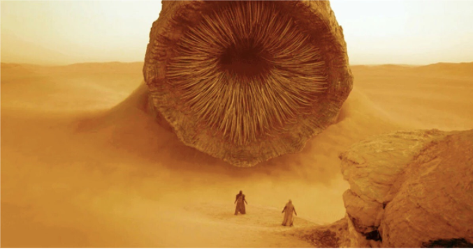
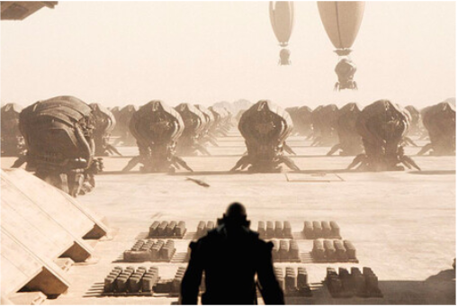
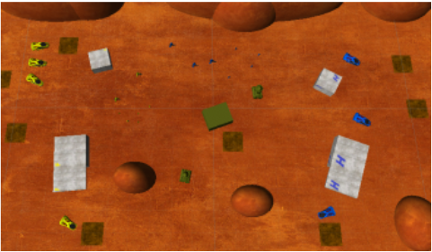

# Resumen enunciado
Está práctica está basada en la exitosa novela *Dune* del autor Frank Herbert, Dune se encuentra lejos en el futuro, en medio de un imperio intergaláctico feudal en expansión, donde los feudos planetarios están controlados por Casas nobles que le deben lealtad a la Casa Imperial Corrino. La novela cuenta la historia del joven Paul Atreides, heredero aparente del duque Leto Atreides y vástago de la Casa Atreides, mientras él y su familia se trasladan al planeta Arrakis, la única fuente del universo de la especia melange. En una historia que explora las complejas interacciones de política, religión, ecología, tecnología y emoción humana, el destino de Paul, su familia, su nuevo planeta y sus habitantes nativos, así como el Emperador Padishah, el poderoso gremio de la Cofradía Espacial y la secreta orden femenina de la Bene Gesserit , se unen en una confrontación que cambiará el curso de la humanidad. Para esta práctica nos adentraremos en el final de la novela,donde se relata la batalla final entre los Fremen y el ejército del Emperador y el Barón Karkonnen en el planeta *Arrakis*. El objetivo principal es crear un controlador automático de uno de los bandos en el campo de batalla, utilizando un mapa de influencia para tomar las mejores decisiones en el campo de batalla.

**Objetivos**

El objetivo de esta práctica es que aprendamos a realizar una **IA Multicapa** con la ayuda de un mapa de influencia, para jugar de forma autónoma, con una toma de decisiones según el momento de la batalla que se esté desarrollando en ese instante, acabando con las unidades enemigas. El escenario proporcionado por el profesor se utilizará para realizar las pruebas pertinentes, pero el prototipo debe ser capaz de funcionar en otros escenarios, cumpliendo una serie de requisitos importantes:

- Aunque pueda haber pendientes, la navegación tiene que ser posible para todas las unidades entre cualquier par de puntos del escenario, no debe haber ninguna zona inconexa.
- Para que haya una batalla justa, los recursos deben estar repartidos equitativamente, para que un bando no esté en inferioridad de combate.
- Existen *poblados graben* que no se pueden atravesar, pero es posible destruirlos mediante ataques de 10 puntos de vida o más. Las *torretas graben* además atacarán a cualquier unidad que se les acerque. Estas tienen una salud de 20 puntos de vida y realizan un daño de 2 unidades por segundo.
- Habrá obstáculos que no se puedan atravesar y no se pueden destruir, como por ejemplo las dunas, pero por otra parte, las instalaciones, unidades, poblados y torretas que no se puedan atravesar, pero se podrán destruir.
- Deberá haber un reparto equitativo de fuerzas, es decir, que haya un espacio suficiente entre todas las instalaciones, torretas y poblados, además de las tropas.

Además, el campo de batalla está compuesto por una serie de instalaciones y unidades que debemos conocer:

- **Instalación base**: Es un edificio que hace de barracón del ejército. Se encarga de la creación de una nueva unidad de alguno de los tres tipos posibles: extractora, exploradora o destructora. Los requisitos para que dicha creación sea posible es que la instalación cuente con dinero (solaris) suficiente para ello y que no se supere el límite máximo de ese tipo de unidades. Los puntos de salud que tiene esta instalación son de 100 puntos. Si se pierden las instalaciones base, se pierde la partida.
- **Instalación de procesamiento**: Es el edificio de refinería del ejército. Se encarga de convertir la especia extraída en el campo de recursos en solaris, es un proceso que se realiza de forma automática. Tiene 50 puntos de salud.
- **Unidad extractora**: Es la unidad responsable de extraer la especia de los campos se encuentra. Se le puede solicitar que se mueva a una posición determinada, de modo que cuando se topa con los campos, se pone a extraer. Tras realizar su trabajo, la unidad extractora irá a devolver su carga a la instalación de procesamiento, ganando los solaris correspondientes (mediante la instalación de procesamiento). Si no se da una nueva instrucción, esta unidad repite el proceso indefinidamente e irá una y otra vez a ese mismo campo de especia a trabajar. En cada viaje se obtienen recursos por valor de 1.000 solaris. Su salud es de 10 puntos de vida. Su fabricación cuesta 10.000 solaris y como máximo puede llegar a haber 5.
- **Unidad exploradora:** Es una unidad bastante útil para moverse por el escenario y también sabe combatir. Se le puede solicitar que se mueva a una posición determinada y, o permanecerá allí inmóvil si la zona es tranquila, o atacará la instalación o unidad enemiga que encuentre cerca, así como la torreta o poblado *graben* que se interponga en su camino, hasta que dicho objetivo sea destruido. Perseguirá a su objetivo si es una unidad enemiga que huye, y a atacar a su agresor (torreta o alguna otra unidad). Su daño es de 2 puntos por segundo y su salud es de 5 puntos de vida. Su coste es de 15.000 solaris y como máximo se pueden tener 30.
- **Unidad destructora:** Es una unidad similar a la exploradora, más poderosa y resistente, pero también más lenta. Funciona de manera similar, aunque no persigue objetivos ni contesta a agresores, tendiendo más a centrarse únicamente en su objetivo a abatir. pero causa muchísimo más daño a los enemigos.Su daño es de 5 puntos por segundo y sus puntos de salud equivalen a 20. Su coste es de 30000 solaris y sólo se pueden tener 10 unidades de este tipo.

El controlador representa al “capitán general” de todo el ejército. Su función es dar órdenes a las unidades de su propio ejército, al igual que a su propia instalación base. Esto lo puede hacer en todos los fotogramas o cada cierto periodo de tiempo, pero teniendo en cuenta que las unidades necesitan tiempo para completar sus acciones y que las órdenes muy seguidas, si son contradictorias, pueden resultar contraproducentes y producir bloqueos.

Para dar órdenes es necesario sondear el entorno, el estado del escenario y de las distintas instalaciones y unidades que allí operan, tanto propias como ajenas.

Punto de partida

Al abrir el proyecto y hacer click en la escena RTSScenario1 o RTSScenario2, vemos un terreno de batalla, con una serie de campos de cultivo de especias, dos instalaciones bases (una de cada bando), dos instalaciones de procesamiento (una de cada bando) y las unidades correspondientes a cada bando.

Cuando pulsamos Play, se puede observar al bando amarillo (enemigo) a la izquierda y a la derecha el bando azul (el que nosotros podemos administrar). Existen diferentes botones en la pantalla, divididos principalmente en 2 subgrupos:

- El primer grupo de botones es el de la configuración de juego, los cuales hay un botón para cambiar el punto de vista, otro para cambiar la velocidad del juego, otro para pausar la partida, otro para reiniciar el juego y otro para salir.
- El segundo grupo de botones sirve para realizar todas las acciones de nuestro juego, como por ejemplo, crear cada una de las entidades (Extractor, Explorador y Destructor) y darles las respectivas instrucciones. También aparece en la parte superior izquierda la cantidad de solaris que tenemos.

Cada botón realiza perfectamente su función (exceptuando el movimiento de los exploradores).

Cuando atacamos al enemigo, éstos tienen la capacidad de defenderse del ataque, pero no atacar hacia nuestra base.

En cuanto al movimiento de las tropas, el movimiento se hace mediante teclas, es decir, hay botones que mueven un determinado tipo de unidad, pero al pulsarlo no se puede elegir qué tropa de ese tipo se va a mover ni el lugar. En la primera escena no se puede seleccionar unidades para moverlas, sin embargo, en la segunda escena si se pueden seleccionar tropas y moverlas con click izquierdo. aunque no se puede deseleccionar una tropa si no es seleccionando otra. Además, los exploradores no se mueven al pulsar el botón “mover explorador”. Por último, uno de los dos extractores iniciales no se mueve hasta pasado un rato.

Inicialmente, el proyecto contiene 104 *scripts*, que se encargan del correcto funcionamiento del juego, es decir, hay scripts para calcular el daño hecho por las unidades, otros para poder procesar que ha llegado un recolector cargado para poder recibir solaris, otros para controlar las tareas que debe hacer una unidad, etc.

Además, están las carpetas de behaviour designer, en las que están los scripts para poder controlar el comportamiento y movimiento táctico.
# Solución
Para la realización de nuestro controlador automático se nos pide realizar las siguientes estrategias:

- Ataque: Si la IA detecta que tiene un 33% más de poder militar entonces decide atacar a la base principal. En el momento que ataca se genera un grupo de ataque, y se generan tropas que se envían al frente a reponer las que vayan cayendo. Si el ataque fracasa y el ejército atacante se vuelve inferior se dejan las tropas restantes para hacer tiempo y se pasa al modo emergencia.
- Emergencia: Este modo se activa cuando se detecte que la IA es vulnerable, en él se generan tropas para mantener un ejército entre el -33% y 0 de fuerte que el enemigo. El rango es porque si económicamente va mal no invierte demasiado en tropas, sino que aunque tenga un ejército inferior tiene lo justo para salir de un apuro y además puede invertir en recolectores. Si va bien en economía simplemente hace un ejército que iguale al ejército enemigo.
- Estabilidad: Esta estrategia se usa en los momentos de calma de la partida, se invierte tanto en economía como en ejército.
- Ataque doble: Si 2 ataques han sido fallidos la IA crea unos cuantos exploradores y realiza dos ataques simultáneos. Con el ejército principal a la base enemiga y con los exploradores a los campos de cultivo. El ejército principal no necesita estar en superioridad, este ataque es para debilitar la economía enemiga.
- Defensa base principal: Si se detecta una fuerza enemiga importante se crean unidades para defender. Como mínimo se necesita un -33% de ejército defensor ya que en el caso de necesitar más o de que la batalla se desarrolle de una forma NO favorable se pueden sacar tropas con un coste en tiempo de 0 y que nacen en el campo de batalla por lo que se ahorran el tiempo de llegar a él.
- Defensa cultivos: Al detectar un ataque contra un recolector se retiran los recolectores cercanos y el que está siendo atacado y se envía una pequeña fuerza de contención. Si se produce a la vez que una defensa a la base principal se llevan tropas si sobran, si no simplemente se retiran los trabajadores. 

Para implementar las estrategias anteriores realizaremos un manager del mapa (MapManager) para tener un control absoluto del mapa de influencia en el que la IA podrá tener una visión clara de qué partes del mapa controla para poder así realizar las decisiones. Por ejemplo si en la frontera cercana a un cultivo detecta un ejército enemigo prepara la estrategia  “Defensa cultivos”, o si no detecta ninguna fuerza en la frontera puede adoptar la estrategia “Estabilidad”, de la misma manera, si un ejército enemigo se adentra en la frontera y se acerca lo suficiente a la base principal se adoptaría la estrategia “Defensa base”.

Se realizarán muchas pruebas para que el funcionamiento del controlador automático sea efectivo, robusto y sea una IA competente, que sea capaz de darle pelea a un jugador humano.
# Bibliografía y/o referentes
- *Diapositivas del Curso 2021-2022 de la asignatura de Inteligencia Artificial del tercer curso del grado de Desarrollo de Videojuegos impartida por Federico Peinado Gil.*
- *AI for Games, Third Edition Ian Millington.*
- *Unity 2018 Artificial Intelligence Cookbook, Second Edition (**Repositorio**)* <https://github.com/PacktPublishing/Unity-2018-Artificial-Intelligence-Cookbook-Second-Edition>
- *Unity Artificial Intelligence Programming, Fourth Edition (**Repositorio**) <https://github.com/PacktPublishing/Unity-Artificial-Intelligence-Programming-Fourth-Edition>*
- *Opsive, Behavior Designer <https://opsive.com/assets/behavior-designer/>*
- *Unity, Bolt Visual Scripting <https://docs.unity3d.com/bolt/1.4/manual/index.html>*
- *Unity, Navegación y Búsqueda de caminos <https://docs.unity3d.com/es/2019.3/Manual/Navigation.html>*

